<!-- ═══════════════════════════════════════════════════════════════════════════ -->
<!--                                                                         -->
<!--                          P A R T H ' s   G I T H U B                    -->
<!--                     — monochrome · minimal · terminal —                 -->
<!--                                                                         -->
<!-- ═══════════════════════════════════════════════════════════════════════════ -->

<div align="center">

  

  <br/><br/>

  [](https://github.com/ParthJaina2107)

  <br/>

  <a href="https://linkedin.com/in/parthjaina/">
    
  </a>
  &nbsp;
  <a href="mailto:parthjaina.2107@gmail.com">
    
  </a>
  &nbsp;
  

</div>

<br/>

<!-- ─── ABOUT ───────────────────────────────────────────────────────────── -->

### &nbsp;&nbsp;`> whoami`

```yaml
name: Parth
handle: ParthJaina2107
location: India 🇮🇳
role: Student & Aspiring AI Engineer

interests:
  - Artificial Intelligence & Machine Learning
  - Deep Learning & Neural Networks
  - Competitive Programming & DSA
  - Data Science & Analytics

currently:
  learning: [ "Transformers", "Reinforcement Learning", "System Design" ]
  building: "Things that think"
  reading: "Research papers I barely understand (yet)"

fun_fact: "I debug with print() statements and I'm not ashamed."
```

<br/>

<!-- ─── CURRENT FOCUS ───────────────────────────────────────────────────── -->

### &nbsp;&nbsp;`> cat current_status.log`

```
🎯 Active Quests
│
├── 🧠  Deep Learning & NLP — exploring attention mechanisms
├── 📐  Data Structures & Algorithms — daily problem solving
├── 🔬  ML Research — reading, implementing, breaking things
├── 🛠️  Side Projects — always shipping something new
└── 📖  Learning — because the day I stop, the code stops too
```

<br/>

<!-- ─── TECH STACK ──────────────────────────────────────────────────────── -->

### &nbsp;&nbsp;`> python3 tech_stack.py`

```python
#!/usr/bin/env python3
"""The tools I build with."""

class Parth:

    languages  = ["Python", "C++", "C", "Java", "JavaScript", "SQL", "HTML/CSS"]
    
    ai_ml      = ["TensorFlow", "PyTorch", "Scikit-Learn",
                  "Pandas", "NumPy", "Matplotlib", "OpenCV"]
    
    tools      = ["Git", "GitHub", "Linux", "VS Code",
                  "Jupyter Notebook", "Docker", "Postman"]
    
    databases  = ["MySQL", "PostgreSQL", "MongoDB"]

    def __repr__(self):
        return "Still learning. Always will be."
```

<br/>

<div align="center">

  <!-- Badges row for quick visual scanning -->
  
  
  
  
  
  <br/>
  
  
  
  
  <br/>
  
  
  
  

</div>

<br/>

<!-- ─── GITHUB STATS ────────────────────────────────────────────────────── -->

### &nbsp;&nbsp;`> stats --verbose`

<div align="center">
  
  &nbsp;&nbsp;
  
</div>

<br/>

<!-- ─── STREAK ──────────────────────────────────────────────────────────── -->

### &nbsp;&nbsp;`> git log --oneline --graph`

<div align="center">
  
</div>

<br/>

<!-- ─── ACTIVITY GRAPH ──────────────────────────────────────────────────── -->

### &nbsp;&nbsp;`> contributions --graph`

<div align="center">
  
</div>

<br/>

<!-- ─── CONTRIBUTION SNAKE ──────────────────────────────────────────────── -->
<!--
  🐍 To enable the contribution snake animation:
  1. Go to your profile repo → Actions → New Workflow
  2. Create .github/workflows/snake.yml with the content from the snake.yml file
  3. Uncomment the section below

### &nbsp;&nbsp;`> watch -n1 snake`

<div align="center">
  
</div>
-->

<!-- ─── FOOTER ──────────────────────────────────────────────────────────── -->

<br/>

<div align="center">
  
  
  
  <br/>
  
  ```
  "The best way to predict the future is to build it." — Alan Kay
  ```
  
  <br/>
  
  <sub>crafted with obsession · powered by caffeine · deployed from 🇮🇳</sub>

  <br/><br/>

  <a href="https://github.com/ParthJaina2107">
    
  </a>

</div>

<!-- ═══════════════════════════════════════════════════════════════════════════ -->
      src="https://raw.githubusercontent.com/parthjaina2107/ParthJaina2107/output/github-snake.svg">
  </picture>
</p>
